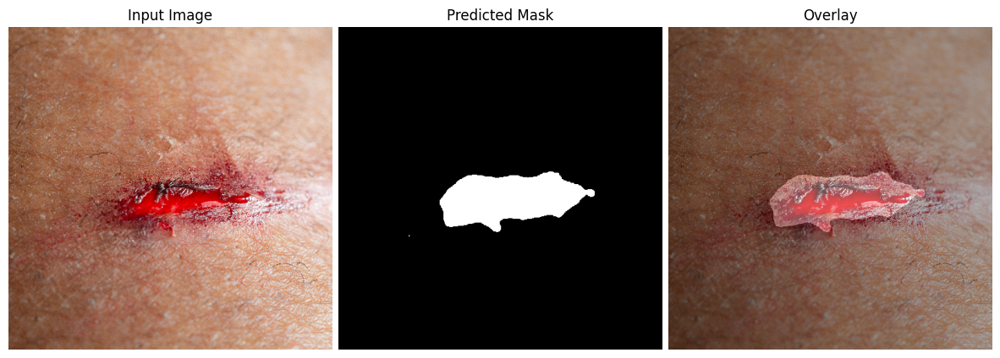

## Wound Segmentation.

**Wound Segmentation** is a deep learning-based tool designed to automatically identify and segment wound regions from RGB clinical images. It is built using a U-Net architecture with an EfficientNetB3 encoder and supports reproducible and modular segmentation workflows. This repository was created for the final examination of the Software and Computing course in the Applied Physics curriculum at the University of Bologna.

The tool offers,
- **Speedy results** after the first download of pretrained model weights.
- **Ease of use** through a simple command-line interface — just copy and paste the commands, and run.

It includes,
- Fully documented source code.
- Image preprocessing, inference, and visualization steps.
- Automated testing with high coverage.
- Command Line Interface (CLI) support for both single image and an image batch processing.

---

### Installation & Setup

To install the application, you can just clone this repository and use pip.

1. **Clone this repository**

   ```bash
   git clone https://github.com/AnukaGunarathna/Wound-Segmentation.git
   cd Wound-Segmentation
   ```

2. **(Optional) Create a virtual environment**
    On macOS/Linux:

   ```bash
   python3 -m venv wound_venv
   source wound_venv/bin/activate
   ```

   On Windows:

   ```bash
   python -m venv wound_venv
   .\wound_venv\Scripts\activate
   ```
3. **Install dependencies**
   Install the required packages using pip. 

   ```bash
   pip install -r requirements.txt
   ```

   >This project requires Python 3.9+ and has been tested on macOS and Windows. See `requirements.txt` for all dependencies.
---

### Usage

Once installed, you can run the segmentation either on a single image or a folder of images. All commands should be run from the root directory of the project.

#### Single Image Inference

```bash
python3 -m wound_segmentation.main --image path/to/image.jpeg 
```

#### Batch Inference on Folder

```bash
python3 -m wound_segmentation.main --input_dir path/to/image_folder
```

You can also optionally specify:

- `--output`: output directory (default is `outputs/`)
- `--threshold`: prediction threshold between 0 and 1 (default is 0.5)
- `--model`: path to custom model weights if not using the default

#### Example

```bash
python3 -m wound_segmentation.main \
  --image path/to/image.jpeg \
  --output results/ \
  --threshold 0.6
```

The first run will automatically download the pretrained model weights from Google Drive.

---
### Example Output

Below is a sample result showing the input image, predicted wound mask, and the overlay.

<p align="center">
  
</p>

> *Test image sourced from Adobe Stock under Standard License for academic non-commercial use.*

---

### Documentation

This project includes complete documentation to help users understand, use, and extend the codebase. It covers usage instructions, command-line options, example outputs, testing setup, and detailed API reference generated from inline docstrings. The structure and design choices are also explained for easier onboarding and maintainability.

For a complete guide, please see the **[full documentation here](https://AnukaGunarathna.github.io/Wound-Segmentation/)**.

If you prefer to build the docs locally,

```bash
cd docs
make html
# Then open docs/build/html/index.html in your browser
```

Documentation is auto-generated with **Sphinx** from inline docstrings and `.rst` files.

---
### Testing

This project includes a full suite of tests written using **pytest**.

Tests are designed to verify all core components of the wound segmentation pipeline, including:

- Preprocessing routines (resizing, cropping, normalization)
- Model loading and prediction
- Loss functions and evaluation metrics

#### Running Tests with Coverage

You can run the tests and generate a coverage report by running this in project root,


```bash
# Make the script executable (only needed once)
chmod +x run_tests.sh

# Run the tests with coverage
./run_tests.sh
```
> Note: You may need to run chmod +x run_tests.sh the first time to make the script executable.

After execution, a coverage report will be printed in the terminal and a detailed HTML report will be saved in `htmlcov/index.html`.

#### Coverage

- Test coverage is tracked using `coverage.py`.
- All non-visual functions and public interfaces are tested.
- Visualization functions and CLI entrypoints are intentionally excluded.

>Coverage status: 100% for tested modules (excluding CLI and plotting functions)
---
### Limitations and Notes

While the tool is designed for practical use and ease of deployment, please be aware of the following limitations,

1. **Supported Image Formats (in batch mode)**  
- Only `.jpg`, `.jpeg`, and `.png` files are supported.  
- All other formats (e.g., `.bmp`, `.tiff`, `.gif`) are silently ignored during batch processing.  
- This behavior can be modified by editing the `valid_ext` variable in `run_batch()` in `main.py`.  
- All output masks are saved in `.png` format.

2. **Model Trained on Specific Dataset (Fresh Wounds)**  
- The pretrained model was fine-tuned on a dataset consisting primarily of fresh clinical wounds.  
- It may not generalize well to domains such as veterinary wounds, synthetic data, or microscopic images.

3. **No On-the-Fly Training or Fine-tuning**  
- Only inference is supported out-of-the-box. Retraining or model fine-tuning requires codebase modification.

4. **Binary Segmentation Only**  
- The model distinguishes only between wound and background.  
- It does **not** support multi-class segmentation.

5. **No Graphical Interface (GUI)**  
- The tool is built for CLI-based workflows. A GUI is not currently provided.

6. **No Automatic Input Validation**  
- The tool expects valid RGB images.  
- Grayscale, corrupted, or improperly formatted images may cause errors or undefined behavior.
---

### Image Attribution

The test images used for evaluation were sourced from [Adobe Stock](https://stock.adobe.com/) and are included under the **Standard License**, which allows academic use, limited distribution, and visualization for non-commercial purposes.  
Please do not redistribute or reuse these images outside the context of this repository.

---
### License

This project is licensed under the [MIT License](LICENSE).

---


